# Case study: ClaimDesk

A design system taken from Figma variables to a tested product UI, built with an AI-assisted workflow. The product is a concept: an insurance claims admin where an AI agent pre-processes claims and a human handler reviews, corrects and approves them.

- Live app: https://nahero.github.io/DS-engine/
- Storybook: https://nahero.github.io/DS-engine/storybook/
- Figma: [DS-Engine-Main](https://www.figma.com/design/LbYcGPXhnrMBahsdvBJ2HI/DS-Engine-Main) · [library](https://www.figma.com/design/dbk2ali9ax6GIGOOXNr2gp/Obra-shadcn-ui-kit)
- How it was built with AI: [how-i-work-with-ai.md](how-i-work-with-ai.md) · Decisions: [decisions/](decisions/)

## 1. The problem

AI can pre-process a claim in seconds. The risk moves to the review: a handler has to see what the agent was unsure about, check it against the source, correct it, and stay inside their authority. The UI has to make that fast without hiding uncertainty.

That gives the design its rules:

- Confidence is always a number, a label and an icon. A missing score reads "No score", never 0%.
- Every extracted value cites its source document and page.
- A correction keeps the agent's original value, who changed it and when.
- Authority limits are stated ("Needs senior approval above €10,000"), not hidden in a disabled button.
- Money has a currency, is right-aligned and uses tabular figures. Dates that decide coverage are kept apart.
- Fraud flags are worded neutrally. Revealing personal data is a logged action.

## 2. Foundations: tokens before screens

- Three tiers: primitive (from the Figma kit) → semantic → component. Components use semantic tokens only.
- One switch per axis, in code and in Figma: light/dark, brand, density.
- The Obra shadcn kit was re-pointed at these tokens, so every kit component follows them without edits.
- Contrast is checked on every build for every brand and mode.

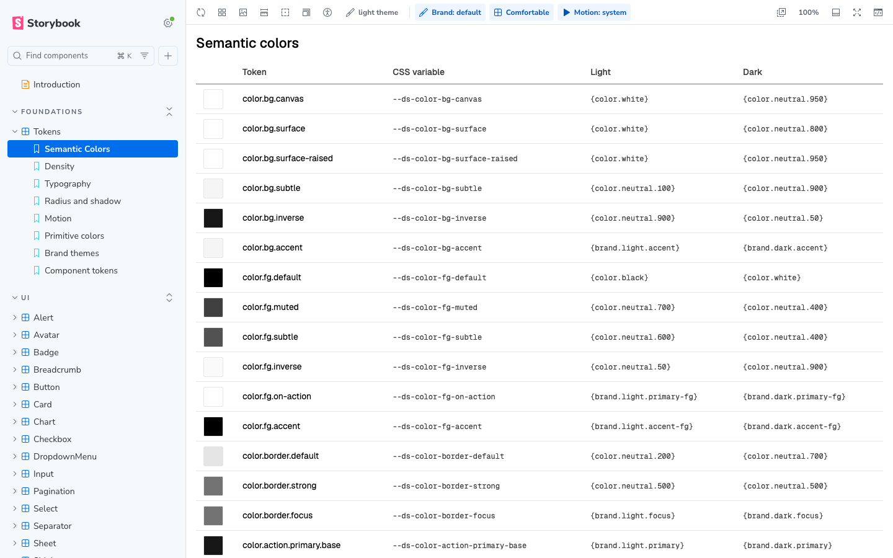

## 3. Figma v1: screens from kit parts

Three screens built from library instances only, with the decisions written under each screen.

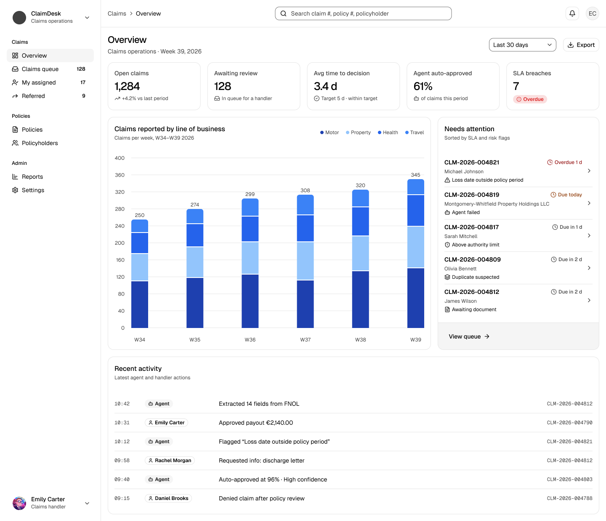
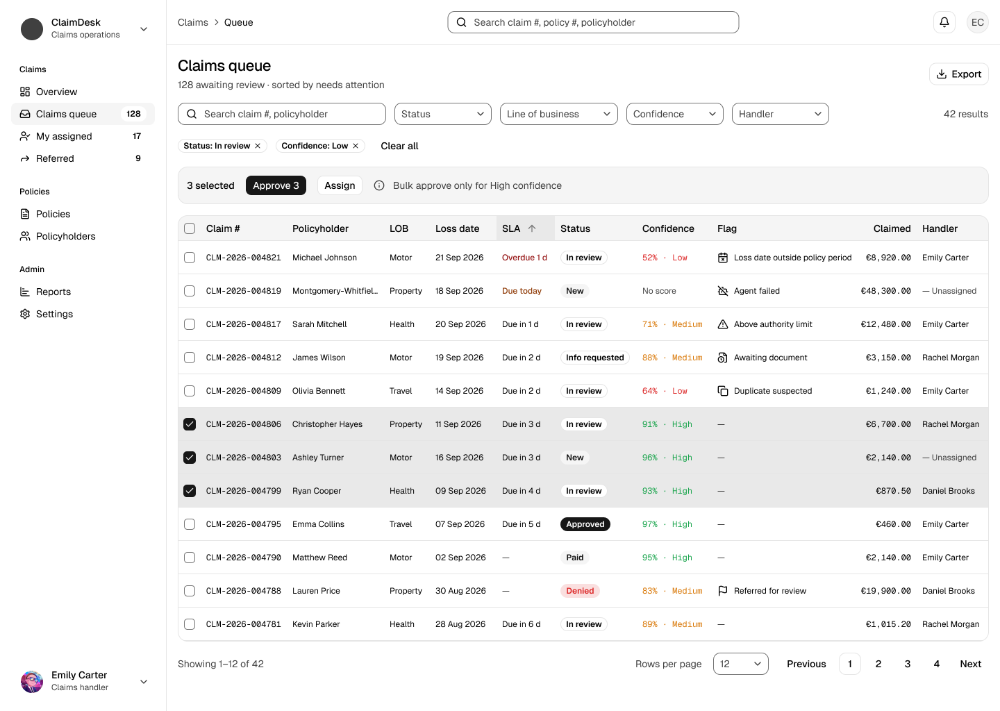
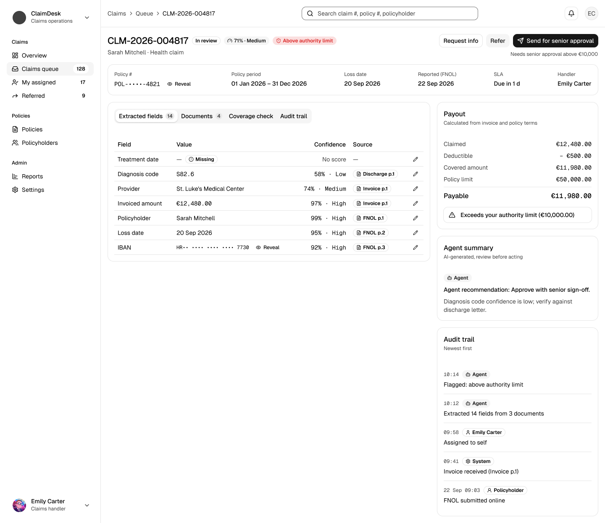

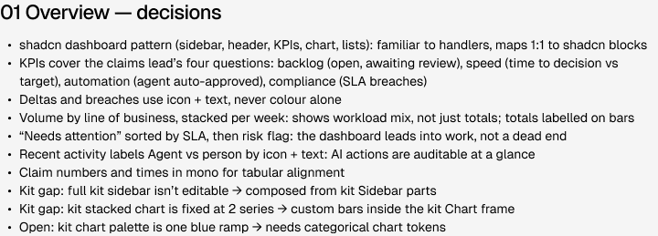

What v1 showed: the kit has no component for confidence, for an extracted field with its source, or for a payout calculation. They were drawn from layout frames, which is where a design system should step in.

## 4. Figma v2: design-system components

Three components were added to the system, each as a variant set with its states, and swapped into a copy of the screens. v1 was kept to show the progress.

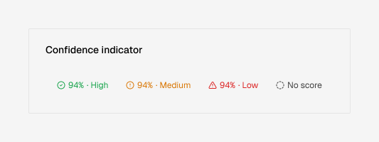
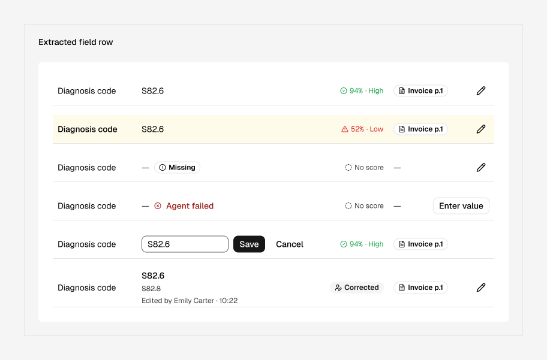
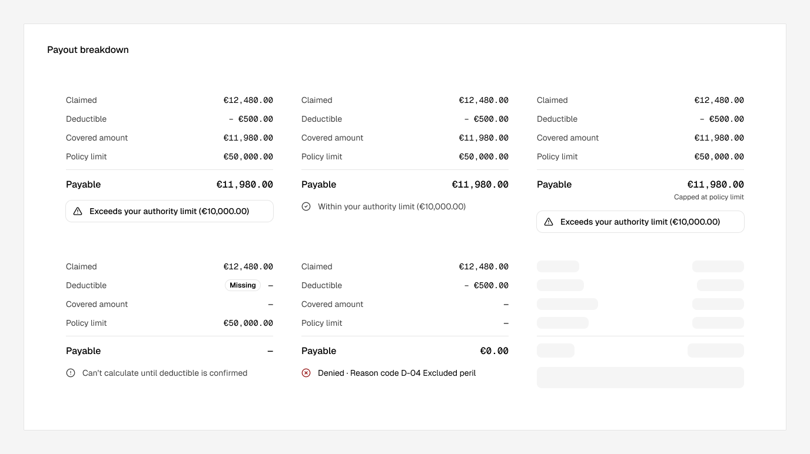

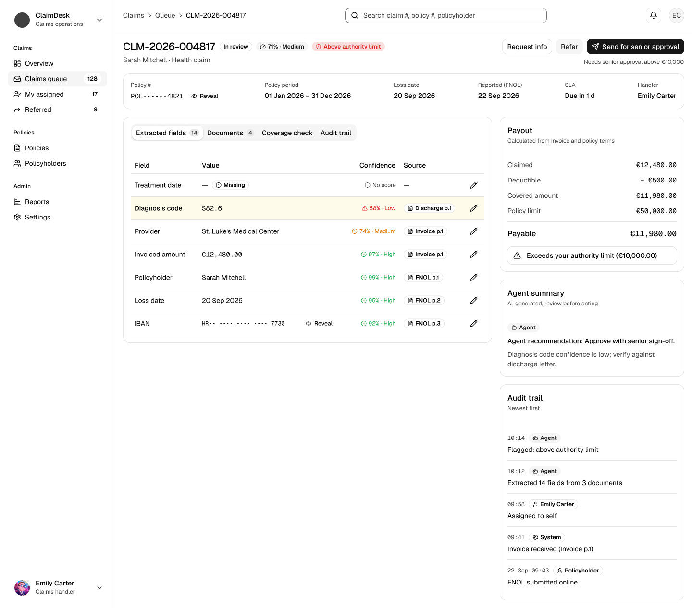

## 5. Code

Built on shadcn/ui and Radix, with only token-backed Tailwind utilities.

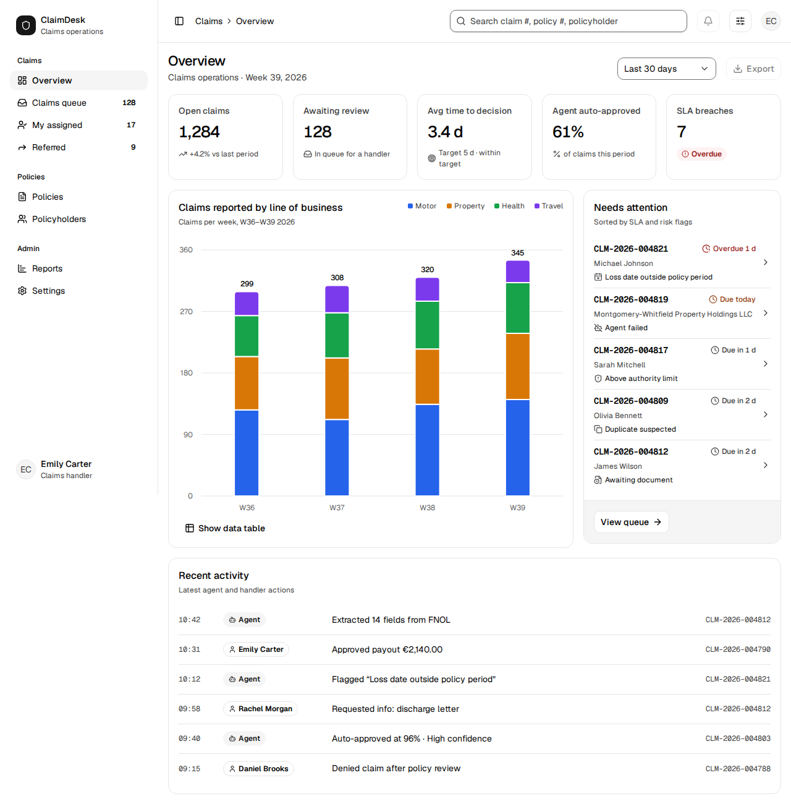
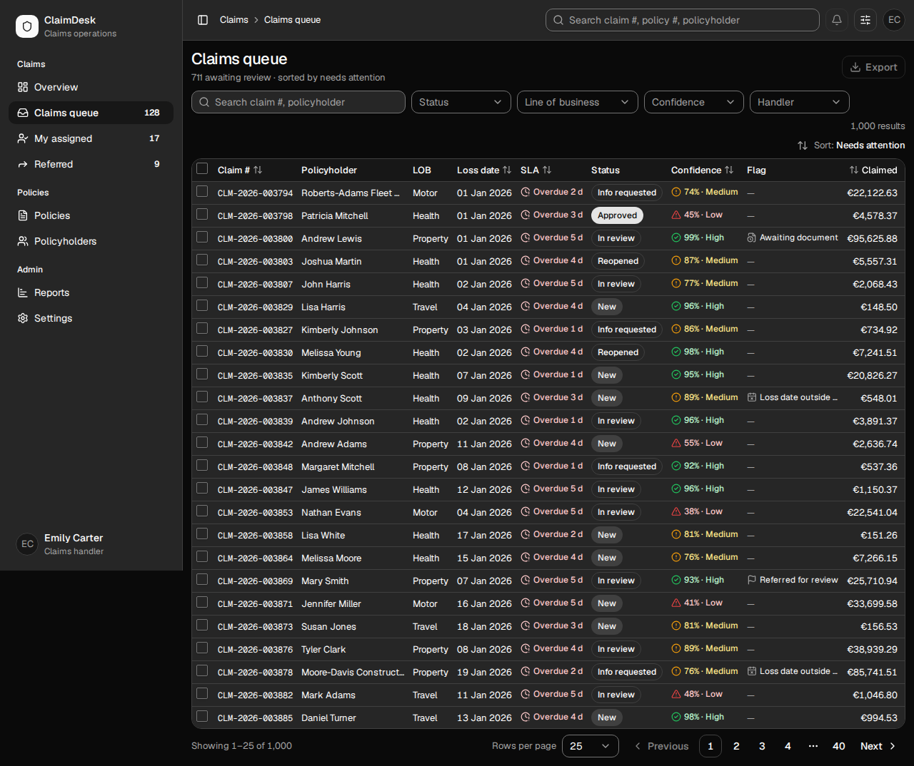
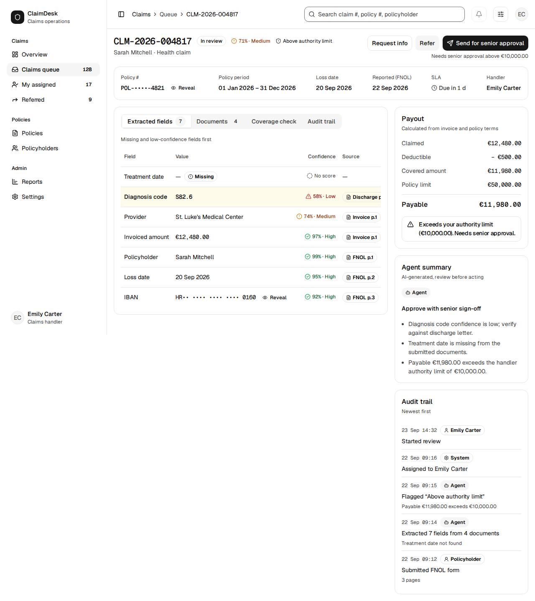

- **Overview:** KPIs, claims by line of business (categorical chart tokens, a data table for keyboard and screen-reader users), what needs attention, recent agent and handler activity.
- **Claims queue:** 1,000 messy claims, sorted by "needs attention". Filters as removable chips, sortable columns, full keyboard support. Bulk approve only when every selected claim is High confidence, and the UI says why when it isn't.
- **Claim detail:** inline correction with an audit trail, citations that open the cited document, the payout calculation, and "Send for senior approval" above the handler's limit.

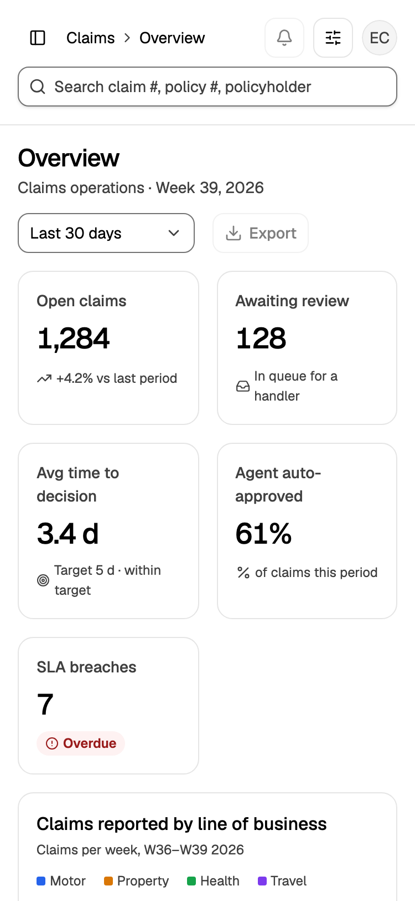

## 6. What changed along the way

| Finding | What changed |
|---|---|
| The kit's chart palette was one blue ramp | New categorical chart tokens, in code and Figma ([0005](decisions/0005-chart-tokens-and-recharts.md)) |
| Confidence colours passed as marks but failed as text | Icons keep the confidence colour, text uses status foregrounds; the pairs joined the contrast check |
| The purple brand barely showed | A brand accent tint for the active nav item, selected rows and hover ([0006](decisions/0006-brand-accent-tint.md)) |
| Rules said "every component has stories"; 35 of 48 didn't | Coverage gates in CI ([0008](decisions/0008-stories-are-tests.md)) |
| Storybook had turned into a test harness | Stories show states; behaviour moved to component and end-to-end tests ([0009](decisions/0009-stories-document-tests-test.md)) |
| Dark mode was only checked by hand | Every story and component test runs twice: light + comfortable, dark + compact. It found a real contrast failure on the first run |

## 7. Quality gates

Nothing deploys unless every gate passes: token drift, contrast, lint, typecheck, story coverage, test coverage, unit, story, component and end-to-end tests, visual regression, bundle budget and Lighthouse.

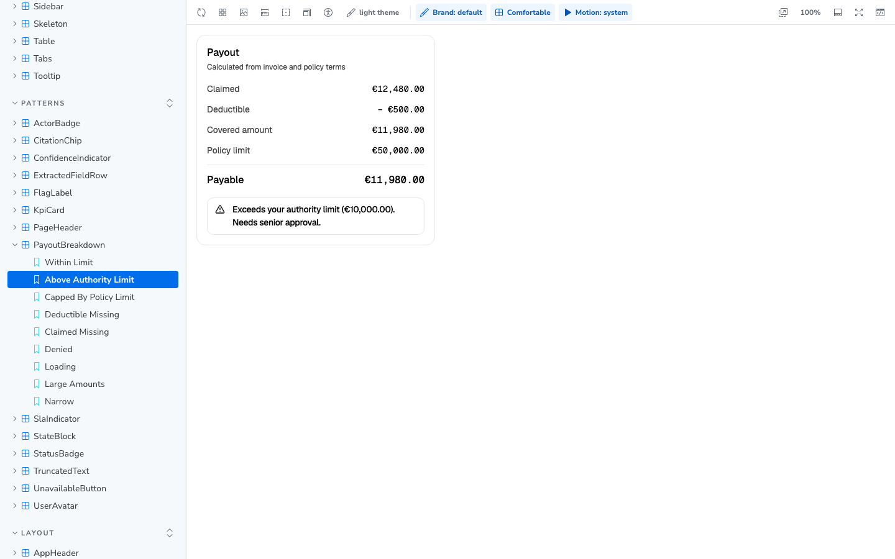
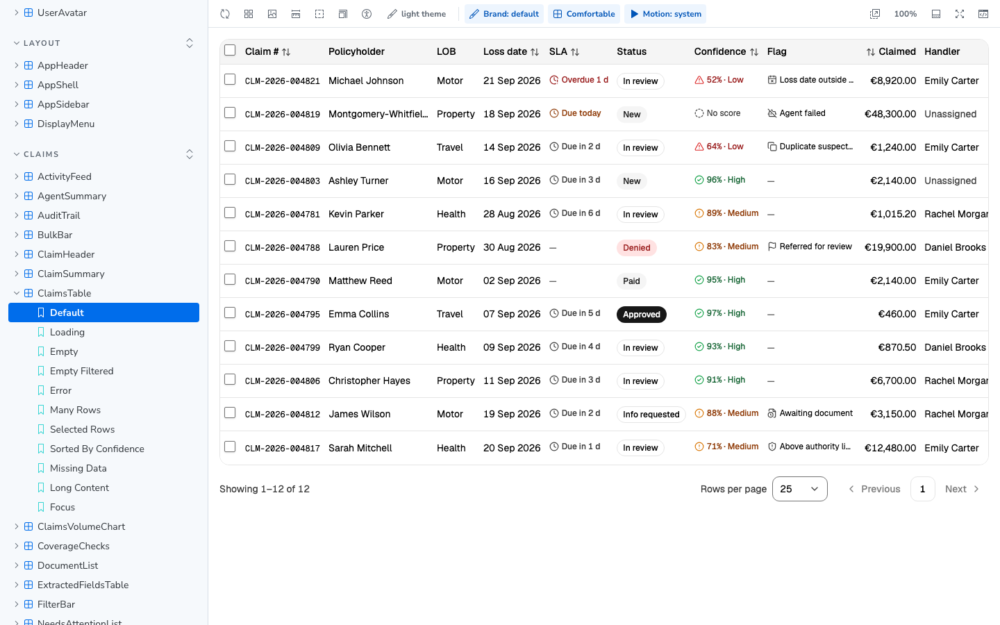

## 8. Performance

- Screens load on demand; the chart library and the claims dataset stay out of the first load.
- First-load JS went from 277.7 kB to 130.4 kB gzip.
- Lighthouse: desktop 100 on all three screens; mobile 89 / 94 / 94; accessibility and best practices 100 everywhere. Budgets run in CI ([0010](decisions/0010-performance-budgets.md), [0011](decisions/0011-gate-on-metrics-not-scores.md)).

## 9. Constraints

- Figma Pro, not Enterprise: no Variables REST API, no Code Connect. Tokens move through Plugin API scripts, and the Figma → code mapping is a table in the docs.
- Code is the source of truth. A script compares every design-system variable in Figma with the token files.
- It is a concept. The insurance rules are researched and applied, not professional practice, and all data is fictional.
